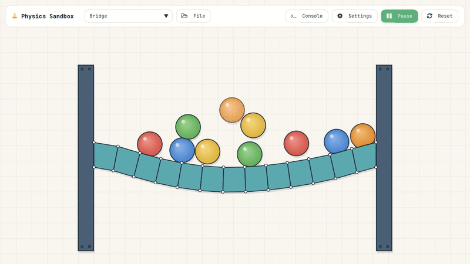
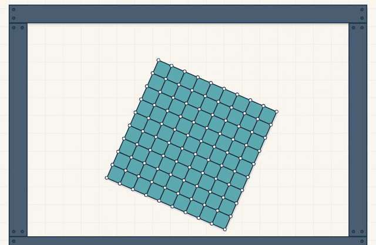

# Soft-body physics

A 2D soft-body physics engine and level editor, written from scratch in C++ without the standard library. It runs natively on macOS and in the browser through WebAssembly, at the display's full refresh rate, so on 120 Hz and faster screens the bodies squash and wobble silky smooth.

**[Try the web demo](https://dan-adeholt.github.io/softbodyphysics/)**, on a computer or a phone.

<p align="center">
  
</p>

<p align="center">
  
</p>

It is heavily inspired by [this video](https://www.youtube.com/watch?v=3OmkehAJoyo) from the author of JellyCar. I usually do full stack web development these days, but I have a background in fairly low-level C++, and this is where I keep that up.

## Features

**Simulation**

* Soft bodies that keep their form through shape matching: every point is pulled toward its place in a best-fit rigid copy of the rest shape, with per-shape stiffness and damping.
* Springs, joints between shapes, and static joints that pin points to the world.
* Fourth-order Runge-Kutta (RK4) integration.
* Wheel motors with traction and braking, for driving vehicles.

**Collisions**

* Broad phase: bounding boxes sorted along one axis, then an 8-DOP overlap test (four projection axes) to reject pairs early. A uniform grid is available as an alternative.
* Narrow phase: point-in-polygon tests, then each penetrating point is projected onto the closest edge it entered through.
* Impulse response with restitution and Coulomb friction, applied to both the point and the edge it hits.
* A separating-axis fallback for shapes that end up deeply overlapping.

**Editor**

* Scene browser, play/pause, single-stepping, and rewind through the last 1000 simulation states.
* Drag points with the mouse, pan and zoom the view.
* Floating profiler with per-phase timings (springs, bounding boxes, collision detection and response, rendering).
* Scenes and prefabs saved and loaded as plain text files.
* Two ways to draw the simulation: a styled look with shading, outlines and drop shadows, and a debug draw mode showing the points, edges and shape matching targets.

## Engineering goals

* **Fast compile times.** Careful header organization, forward declarations, and very restrictive use of templates. I have never been a fan of clever template code that takes ages to compile.
* **No STL.** The native build uses `-nostdlib++ -fno-exceptions -fno-rtti`, so the engine runs on its own containers (`Array`, `Range`, `Span`, `StringBuffer`). For more serious projects I have always used the STL, but this is a hobby project, so why not challenge my own perspective.
* **Simple, data-oriented structures**, inspired by Mike Acton's talks. Point masses are stored as structure-of-arrays (positions, velocities and masses in separate arrays) so the hot loops stream through contiguous memory.
* **Parallel where it pays.** Spring and shape-matching forces are split across worker threads by a small task scheduler (native only).
* **Smooth at any refresh rate.** Frames follow the display, 120 Hz and up included: through vsync natively and `requestAnimationFrame` in the browser. The physics runs in fixed 1 ms steps, so every frame shows a fresh state, and natively each frame's time is snapped to a whole number of refresh intervals, so the simulation moves on by exactly the same amount every frame, without the judder of a loop fixed at 60 Hz.
* **Hot reload.** On macOS a thin shell executable loads the game as a dynamic library and reloads it when it is rebuilt, keeping the window and console.

## Building

### Web

Requires the [Emscripten SDK](https://emscripten.org/docs/getting_started/downloads.html) and Node.js.

```sh
npm install
npm run dev:web    # build, watch the C++ sources and serve on http://127.0.0.1:5200
npm run build:web  # production bundle in web/dist
```

The scripts use `emcmake` from your `PATH`, or a sibling `../emsdk` checkout if there is one. `dev:web` rebuilds the wasm bundle whenever a source or asset file changes, then reloads the page. Don't run both at once: they write to the same output folder.

Every push to `main` builds the web demo with Emscripten and publishes it on GitHub Pages, through the workflow in `.github/workflows/pages.yml`.

The Emscripten cache lives in `.cache/emscripten` by default. If you override `EM_CACHE`, the scripts resolve it to its real path first, which avoids the `/tmp` -> `/private/tmp` symlink problem that breaks Emscripten 5.0.3 on macOS.

### Native (macOS)

Requires CMake, Ninja, and the [SDL3](https://github.com/libsdl-org/SDL/releases) framework installed in `/Library/Frameworks`.

```sh
cmake -S . -B build-release -G Ninja -DCMAKE_BUILD_TYPE=Release
cmake --build build-release
./build-release/SoftBodyPhysics.app/Contents/MacOS/SoftBodyPhysics
```

Run it from the repository root: it loads `build-release/libSoftBodyPhysicsShared.dylib` and the level data by relative path. `watch.sh` rebuilds the library on every change (it needs [entr](https://github.com/eradman/entr)), and the running app picks the new build up automatically.

### Tests

```sh
cmake -S . -B build -G Ninja -DCMAKE_BUILD_TYPE=Debug
cmake --build build
ctest --test-dir build
```

Unit tests cover the containers and the physics. `PerfTest` benchmarks the integrator and the collision solver.

## Project layout

| Folder | Contents |
|---|---|
| `physics/` | Integrator, springs and shape matching, collision detection and response, scene storage |
| `containers/` | `Array`, `Range`, `Span` and `StringBuffer`, plus their tests |
| `math/` | `Vector2` |
| `game/` | Game loop, editor UI, scene definitions, rendering |
| `tasks/` | Worker-thread task scheduler |
| `web/`, `scripts/` | Browser shell and the Emscripten/Vite build scripts |
| `levels/`, `scenedefs/` | Saved scenes and prefabs |

## License

The project's own code is MIT, see [LICENSE](LICENSE). Bundled third-party code and fonts keep their own
licenses, listed in [THIRD_PARTY_NOTICES.md](THIRD_PARTY_NOTICES.md).
